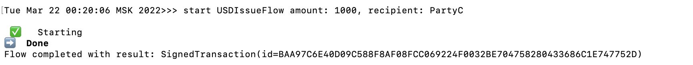
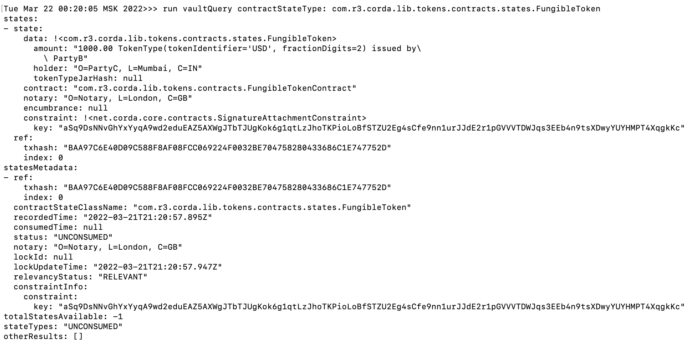
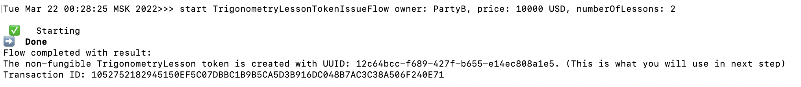
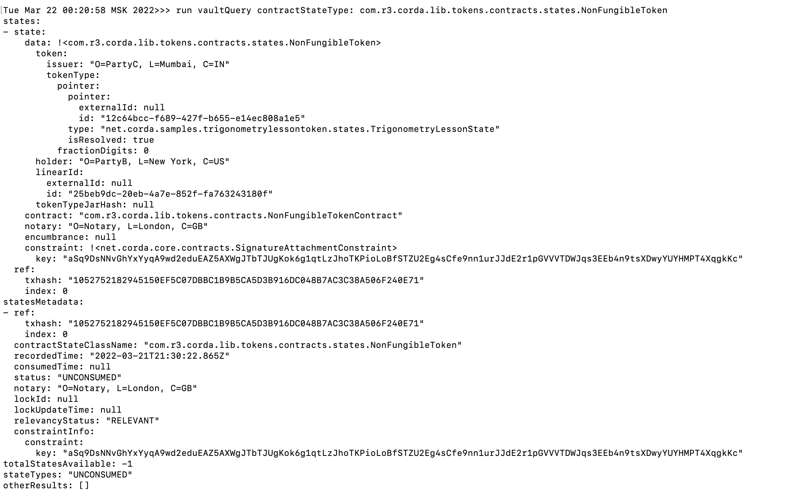
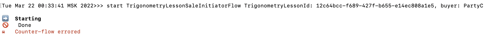
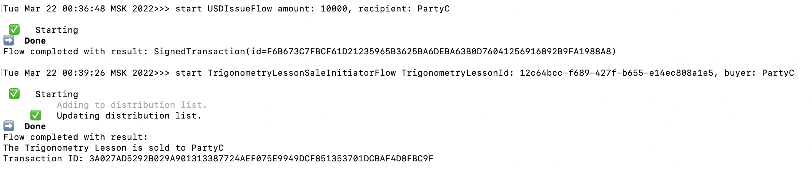
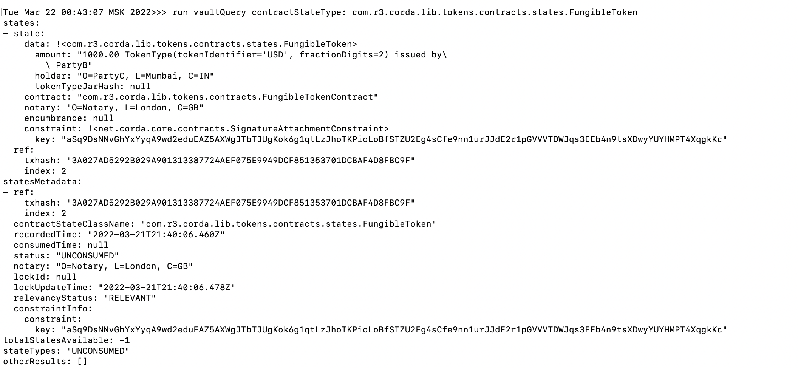
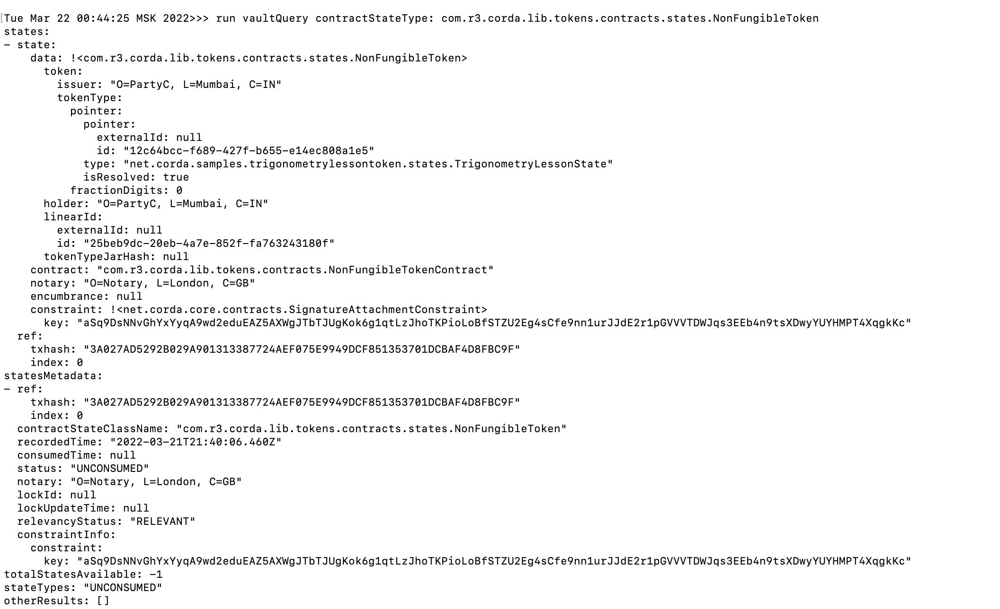
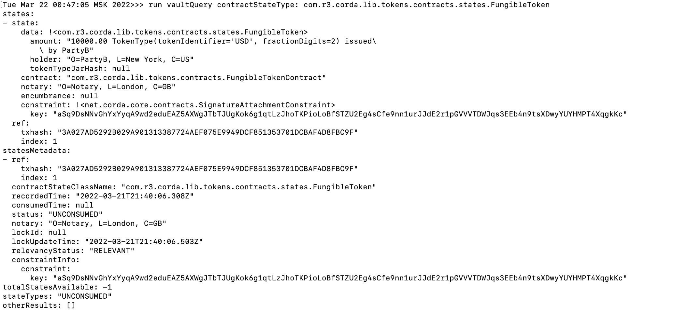
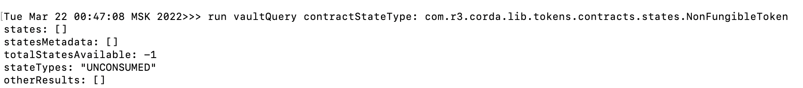

# TrigonometryLessontoken

Мы создали токен "Уроки тригонометрии", он является уникальным и продается за доллары.
Ниже приведено демо создания и продажи со скриншотами

1) Выдаем PartyC (студент) тысячу долларов:
   start USDIssueFlow amount: 1000, recipient: PartyC

2) Видим что токены начислены:
   run vaultQuery contractStateType: com.r3.corda.lib.tokens.contracts.states.FungibleToken

3) Высшая школа экономики (PartyB) выпускает два урока по тригонометрии в виде своего токена, стоимость 10000 долларов:
   start TrigonometryLessonTokenIssueFlow owner: PartyB, price: 10000 USD, numberOfLessons: 2

4) Проверяем баланс:
   run vaultQuery contractStateType: com.r3.corda.lib.tokens.contracts.states.NonFungibleToken

5) Студент пытается купить уроки, но ему нужно примерно в 10 раз больше денег, транзакция не проходит:
   start TrigonometryLessonSaleInitiatorFlow TrigonometryLessonId: 12c64bcc-f689-427f-b655-e14ec808a1e5, buyer: PartyC

6) Выдаем студенту еще 10 тысяч долларов и пытаемся купить:
   start USDIssueFlow amount: 10000, recipient: PartyC
   start TrigonometryLessonSaleInitiatorFlow TrigonometryLessonId: 12c64bcc-f689-427f-b655-e14ec808a1e5, buyer: PartyC

   

7) Проверяем баланс уроков и баланс счета студента:
   run vaultQuery contractStateType: com.r3.corda.lib.tokens.contracts.states.FungibleToken
   run vaultQuery contractStateType: com.r3.corda.lib.tokens.contracts.states.NonFungibleToken
У него есть уроки и осталась тысяча долларов

  
  

8) Аналогично у университета теперь есть 10 тысяч долларов и нет уроков

  
  